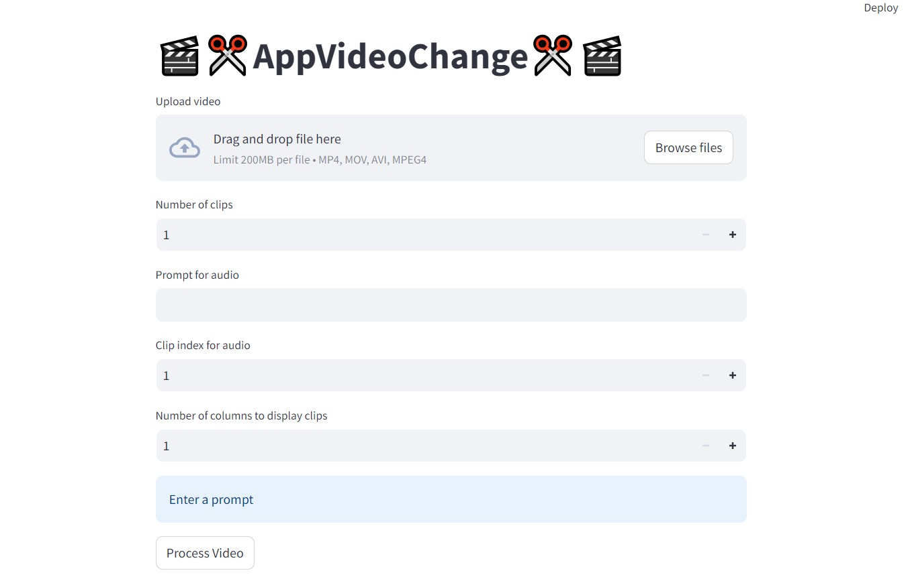

# 🎬✂️AppVideoChange✂️🎬

This project is a web application for manipulating video files. It allows users to upload a video, split it into multiple clips, generate an audio track based on a user-provided prompt, and replace the audio of a specified clip with the generated audio. The application provides an option to display the clips in multiple columns to avoid long scrolling and allows downloading all clips as a zip file.

## Features
 - Upload a video file (supported formats: mp4, mov, avi).
 - Specify the number of clips to split the video into.
 - Enter a prompt to generate an audio track.
 - Choose which clip to replace the audio with the generated audio track.
 - Optionally specify the number of columns to display the clips.
 - Download all processed clips as a zip file.
 - Uses Riffusion for audio generation (preferably run on GPU).
 - Ensures the generated audio matches the duration of the target clip.
## Technologies
- **Streamlit**: For the user interface.
- **MoviePy**: For video manipulation.
- **Riffusion**: For audio generation from text prompts.

## Installation GitHub
Prerequisites
Python 3.8 or later
Anaconda or Miniconda (recommended for managing dependencies)

- Clone the repository:

```
git clone https://github.com/Yevheniia-Ilchenko/AppVideoChange.git
```
- Create and activate a virtual environment:


- Install dependencies:

```
pip install -r requirements.txt
```
### Run the application with Streamlit:
```
streamlit run newmain.py
```
### Run the application with Docker (locally):
If you want to build and run the Docker image locally with Docker, follow these steps:
- Build the Docker image:
``` 
docker build -t your-local-image-name .
```

- Run the Docker container:
```
docker run -p 8501:8501 your-local-image-name
```
Replace 8501:8501 with the appropriate port mapping if your application uses different ports.

## Installation DockerHub

- Login into the Docker:
```
docker login
```
- Pull the project:

```
docker pull evgeniiailchenko/appvideochange
```
### Run the Docker container:

```
docker run -p 8501:8501 appvideochange
```
Replace 8501:8501 with the appropriate port mapping if your application uses different ports.


## Usage
- Upload Video: Upload the video file you want to manipulate.
- Specify Clips: Enter the number of clips you want to split the video into.
- Enter Prompt: Provide a text prompt for generating the audio track.
- Select Clip: Choose the clip index to replace its audio with the generated track.
- Optional Settings: Specify the number of columns to display the clips (default is 3 columns).
- Process Video: Click the "Process Video" button to start the processing.
- Download Clips: Once processing is complete, download the processed clips as a zip file.


## Backends

### CPU
`cpu` is supported but is quite slow.

### CUDA
`cuda` is the recommended and most performant backend.

To use with CUDA, make sure you have torch and torchaudio installed with CUDA support. See the
[install guide](https://pytorch.org/get-started/locally/) or
[stable wheels](https://download.pytorch.org/whl/torch_stable.html).

To generate audio in real-time, you need a GPU that can run stable diffusion with approximately 50
steps in under five seconds, such as a 3090 or A10G.

Test availability with:

```python3
import torch
torch.cuda.is_available()
```

### MPS
The `mps` backend on Apple Silicon is supported for inference but some operations fall back to CPU,
particularly for audio processing. You may need to set
`PYTORCH_ENABLE_MPS_FALLBACK=1`.

In addition, this backend is not deterministic.

Test availability with:

```python3
import torch
torch.backends.mps.is_available()
```


## AppVideoChange

AppVideoChange contains a [streamlit](https://streamlit.io/) app for interactive use and exploration.


And access at http://127.0.0.1:8501/



